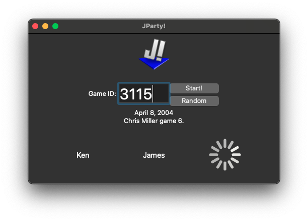
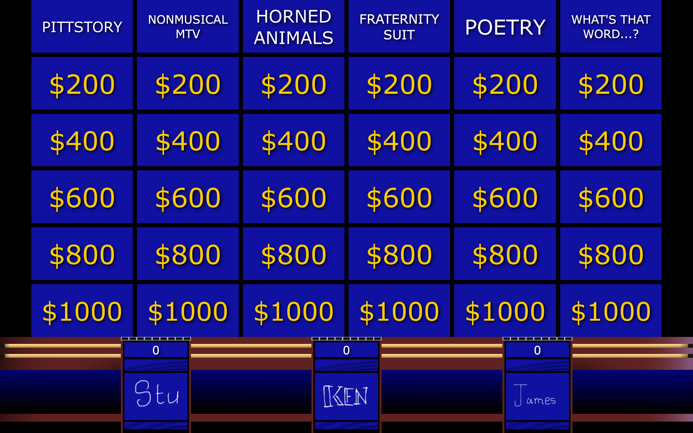

# JParty!


_The Jeopardy! Party Game_

Homepage: https://www.stuartthomas.us/jparty/

Ever wanted to play the game show Jeopardy? This Python-based application aims to provide a full _Jeopardy!_ simulator complete with real questions from actual games. This game is perfect for parties and supports 3-8 players plus a host. Typically, _Jeopardy!_ has three contestants which is recommended for the best experience; JParty supports up to 8 players for larger groups (warning: may cause many complaints about buzzer races). For ideal usage, plug a laptop into a TV, setting the laptop as the main monitor. Note that connecting wirelessly using AirPlay works but may cause latency in the buzzer. Instruct contestants to join the same Wifi network as the computer and scan the QR code on the screen. The person with the laptop is the host and runs the game by reading the questions and running the buzzers.

## Download
See <a href="https://github.com/stuartthomas25/JParty/releases">Releases</a> page.

## Screenshots:

Welcome screen:



The main game board:



The host sees the answer on the laptop screen and can adjudicate with the arrow keys:


## Features:
- WebSocket buzzer for use on mobile devices 
- Up to 8 players
- Complete access to all games on J-Archive
- Load custom games via a <a href="https://docs.google.com/spreadsheets/d/1JqfJ_OgTstaXTyH5nV3_eN6YXqvZ1RviPmN7OwLhG0U/edit?usp=sharing">simple Google Sheets template</a>
- Scrape games from https://jeopardylabs.com using this <a href="https://chrome.google.com/webstore/detail/jeopardy-labs-to-csv/biijijhfghhckhlkjbonjedmgnkmenlk?hl=en&authuser=0">Google Chrome extension</a>
- Final Jeopardy, Daily Doubles, Double Jeopardy

## Requirements:
### For running the app (binary)
- macOS, Windows or Linux
- Two monitors
- A device with web access for each player

### For compiling from source code
- Python [>=3.9]
- PyQt6
- requests
- simpleaudio
- tornado
- BeautifulSoup4
- qrcode
- pyinstaller [>=5.0]

To debug, run 

```
conda env create -f environment.yml
cd jparty
python ../run.py
```

To build from source, run

```
pyinstaller -y JParty.spec
```

## FAQ

### How does it work? (technical details)
JParty minimally scrapes the J-Archive (https://j-archive.com) to download a previously-played game and then simulates that on the screen. The game then uses PyQt6 to produce a GUI that simulates the motions of a full _Jeopardy!_ game. A `tornado` web server uses WebSockets to connect to the contestants' smartphones. If that's all gibberish to you, don't worry! You can still play without any technical knowledge.

### Can I create my own custom game?
Yes! JParty supports playing your own custom game via <a target=_blank href="https://docs.google.com/spreadsheets/d/1JqfJ_OgTstaXTyH5nV3_eN6YXqvZ1RviPmN7OwLhG0U/edit?usp=sharing">this simple Google Sheets template</a>. First, make a copy of the template and change the sharing permissions to "Anyone With the Link Can View". Then, copy the Google Sheet file ID and paste it into the "Game ID" box. There are more detailed instructions on the template page. Limitations: there is no way to add pictures (yet!) and you are limited to the traditional 6 categories x 5 dollar values board. 

If you don't want to write your own questions but want to play a topical _Jeopardy!_ game, use this handy <a target=_blank href="https://chrome.google.com/webstore/detail/jeopardy-labs-to-csv/biijijhfghhckhlkjbonjedmgnkmenlk?hl=en&authuser=0">Google Chrome extension to scrape Jeopardy Labs questions</a> (<a href=https://github.com/benf2004/JeopardyLabsToCSV>source code</a>). There are millions of games available on https://jeopardylabs.com that are free to play on a variety of topics. While Jeopardy Labs is a great repository for many topical games & worked great 20 years ago, it lacks in features such as daily doubles, final jeopardy, music/sound effects, and buzzers. 

To use the extension:
1. Make a copy of the <a target=_blank href="https://docs.google.com/spreadsheets/d/1JqfJ_OgTstaXTyH5nV3_eN6YXqvZ1RviPmN7OwLhG0U/edit?usp=sharing">Jparty Google Sheets custom game template</a>
2. Find a game on https://jeopardylabs.com. 
3. Click the extension icon.
4. The questions will download as a csv (spreadsheet) in the style of the template. 
5. Copy the questions into your Google Sheet template
6. Paste the Google Sheet file ID into the "Game ID" box in JParty.

### The QR code doesn't work!
First, make sure you are on the same wireless network as the computer. If this still doesn't work, it may be an issue with allowing local devices on the network. In this case, you can try another network or try tethering both the phones and the computer to another phone.
