

    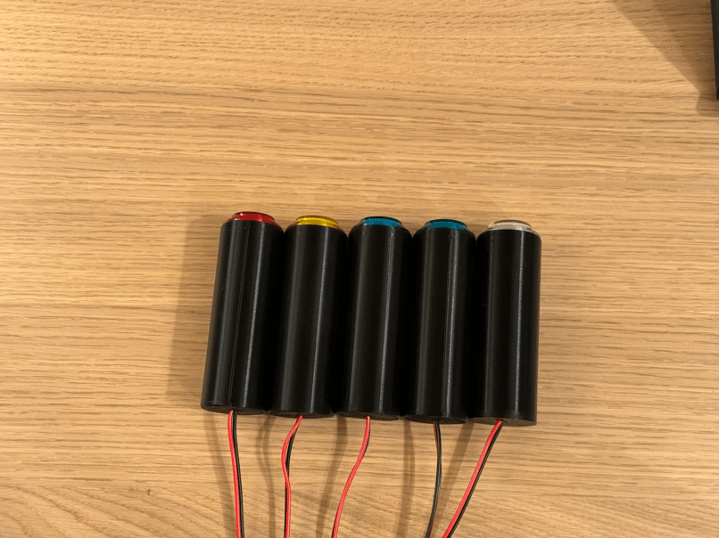

### Building The Physical Buzzers: 
- [What You Need (Parts List)](#what-you-need)
- [Preparing The Materials To Build A Physical Buzzer](#preparing-the-materials-to-build-a-buzzer)
- [Building Your First Physical Buzzer](#building-your-first-buzzer)
- [Connecting The Physical Buzzers To JParty](#connecting-the-physical-buzzers-to-jparty)

We may offer assembly of the physical buzzers in the future, that information will be added here if available. In the meantime, you can follow the instructions below!
#### What You Need:
To build the physical buzzers you will need the following items (Amazon Links Included):
- Easyget 2 Player Zero Delay Generic Game Controller USB (This is the one we used) ([Amazon Link](https://www.amazon.com/gp/product/B01FZ6QVWO))
- HAPP Type Arcade Buttons ([Amazon Link](https://www.amazon.com/gp/product/B01M0XPWGG))
- 22 Gauge 2pin 2 Color Wire ([Amazon Link](https://www.amazon.com/gp/product/B07SLBD1FY))
- Heat Shrink Tubing ([Amazon Link](https://www.amazon.com/gp/product/B07WWWPR2X))
- Handheld Hot Air Tool (Optional) (You can also use other heat sources for shrinking heat shrink if you don't have/don't want to buy this) ([Amazon Link](https://www.amazon.com/gp/product/B08VFY8THD))
- Wire Cutters (If you don't already have) ([Amazon Link - Any Other Choice Works Of Course](https://www.amazon.com/IGAN-P6-Precision-Clippers-Spring-loaded-Handmade/dp/B087P191LP))
- Wire Strippers ([Amazon Link - Any Other Choice Works Of Course](https://www.amazon.com/VISE-GRIP-Stripping-Cutter-8-Inch-2078309/dp/B000JNNWQ2))
- 3D Printer: A 3D Printer is used to print the body and lid for the physical buzzers. If you don't have one feel free to contact us and we can point you in the right direction for getting the body and lid printed for you.
- 3D Printed body and lid for the buzzers. ([Physical Buzzer Body and Lid STL files](other-physical-buzzer-files/physical-buzzer-body-lid-stl-files)) 
    - Each physical buzzer body is comprised of the handheld main body and a lid that holds the arcade button into the main body.
    - For instructions on 3D printing these parts please see [3D Printing Instructions](#3d-printing-instructions)
- Optional Parts:
    - USB Extension Cable (For Getting The Game Controller Closer To The Contestants) (If you don't already have) (We have tested an extension cable up to 6 feet, we will most likely test a 20-foot extender soon and make an edit here) ([Amazon Link - Any Other Choice Works Of Course](https://www.amazon.com/Extension-Material-ITANDA-Playstation-Keyboard/dp/B08FJ88BP2))

#### Preparing The Materials To Build A Buzzer:
For one well-made buzzer you will need:
- 1 HAPP Type Arcade Button
- 1 piece of 22 Gauge 2pin 2 Color Wire cut to length with both ends stripped (we have tested up to 14 feet, but theoretically it could be longer, we just have not tested it yet. Currently our version is using 7 foot wires for each buzzer)
- 1 wire harness cut in half with both ends stripped
- 4 small pieces of heat shrink tubing and 2 bigger pieces of heat shrink tubing
- 1 3D Printed body and lid

#### **Building Your First Buzzer:**

#### Step 1: Prepare All Of The Materials As Mentioned Above
We will need to use all of the materials mentioned above to create 1 buzzer. Below is a picture of all of these materials laid out

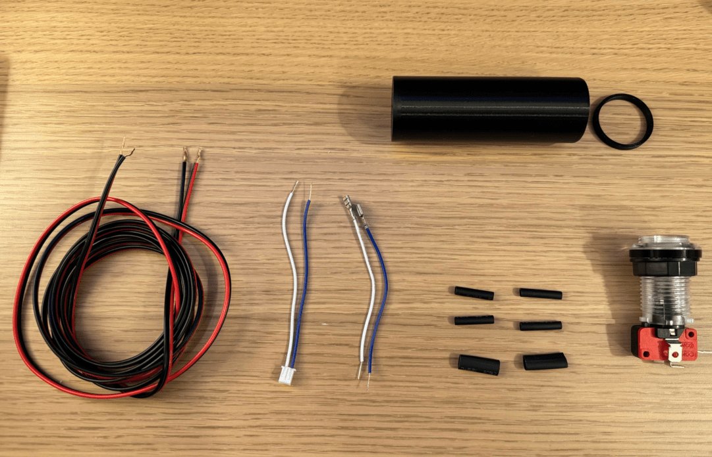

#### Step 2: Creating The Main Wire

First, we need to connect the white connector part of the wire harness to the 22 gage wire. We are doing this first since we will run the other end of the wire through the 3D Printed body before attaching the other end of the wire harness. (wire order doesn't necessarily matter, just keep it consistent). First, before we connect the wires we want to add two small pieces of wire shrink to the 22 Gauge 2pin 2 Color Wire. Once we have done this we can then connect the blue wire to the black wire and the white wire to the red wire by twisting each corresponding wire together. Then, straighten the wires slide the shrink tubing over the exposed wires and then heat the shrink tubing. We have now completed one end of the wire.

*Note: don't forget to add your shrink tubing to the wires before twisting them together*

Complete Pictures:

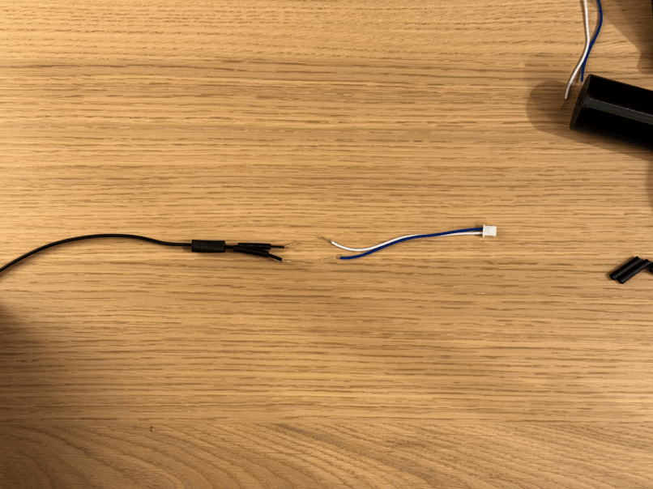
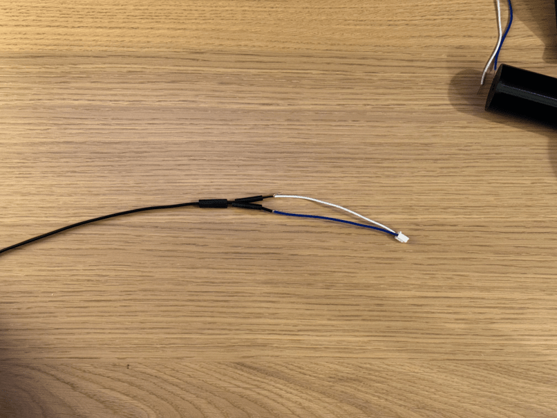
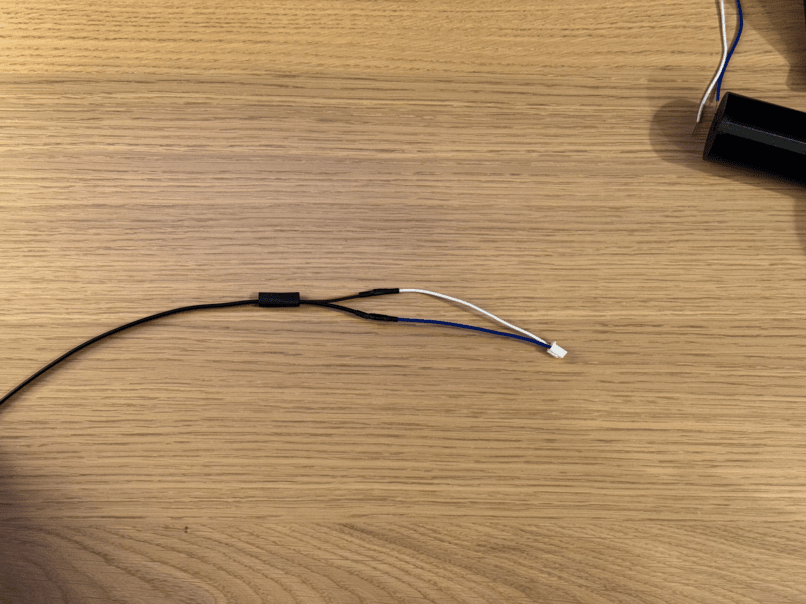
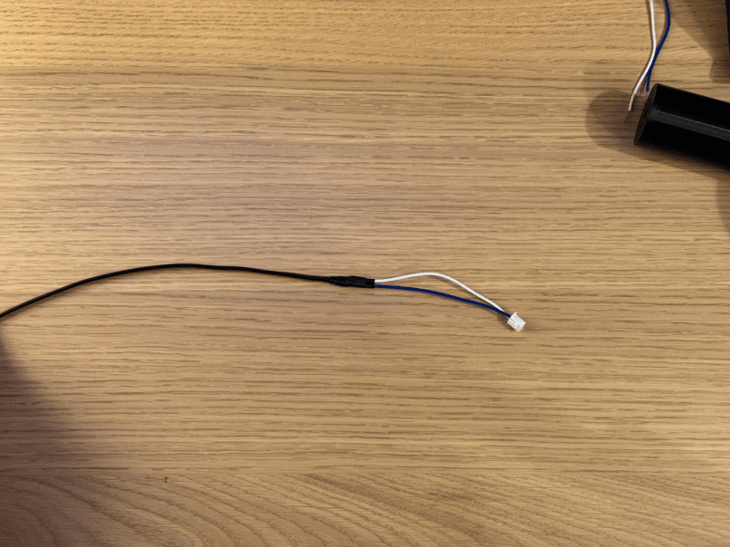

Next, we will complete the other end of the wire that will attach to the button. First, run the other end of the 22 Gauge 2pin 2 Color Wire through the hole on the bottom of the 3D Printed body. Pull a couple of feet of this wire through the hole to give us some slack to work with. Then you will complete the same process as above with the connector ends of the wire harness (the metal prong part). Once connected the same way as above the main wire is complete. We can then move on to step 3.

*Note: don't forget to add your shrink tubing to the wires before twisting them together*

Complete Pictures:

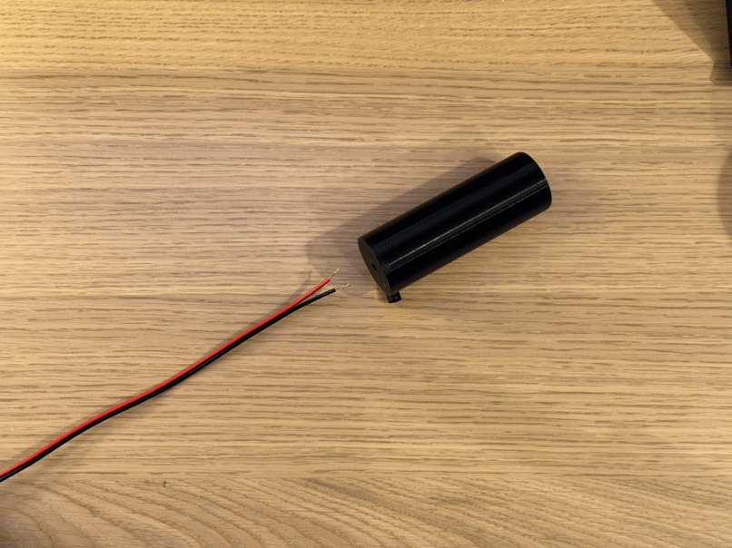
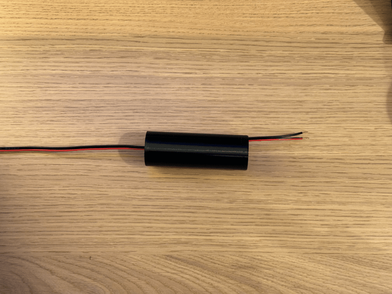
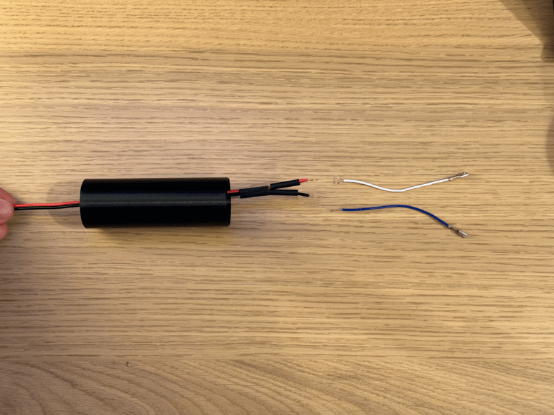
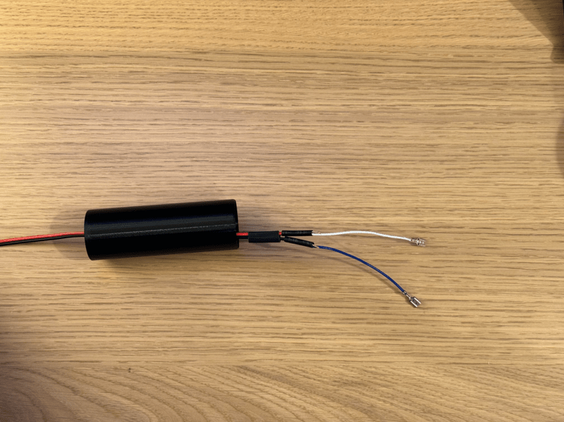
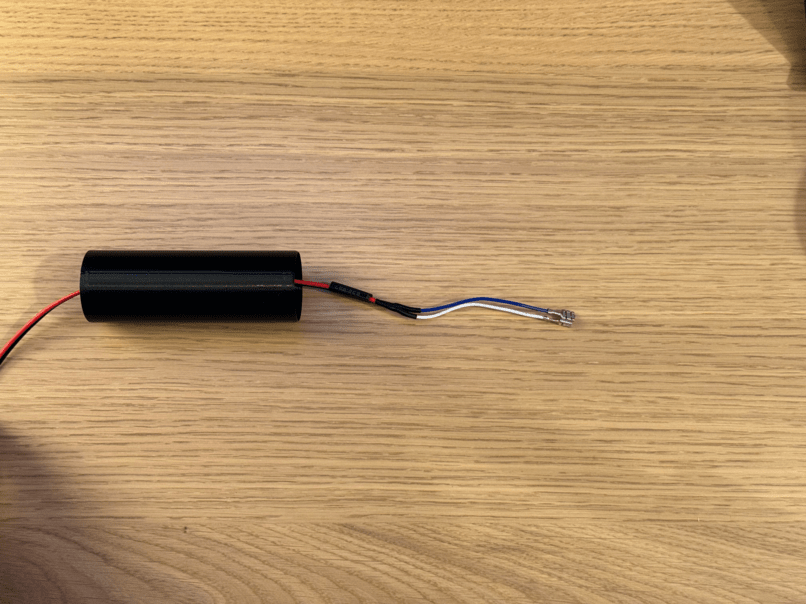
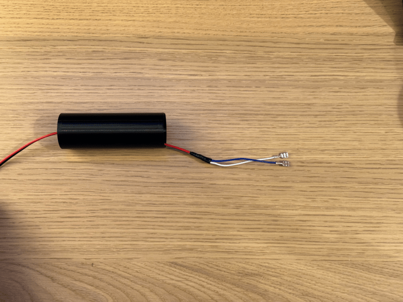

#### Step 3: Bend Down The Connection Pins On The Arcade Button
In order to fit the arcade button in the body we need to bend down two of the pins on the arcade button. The other two pins that are on opposite sides of the button are for LEDs which we did not utilize in this project.

Bend down the pins shown in the picture below:

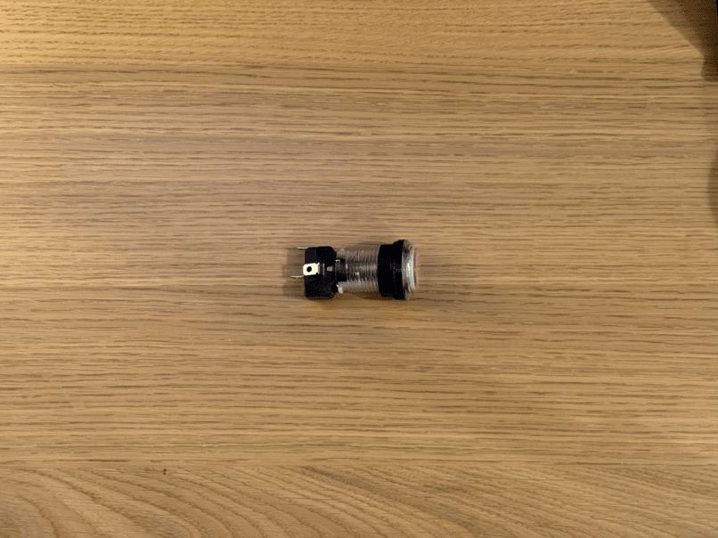

#### Step 4:
Connect the connector ends of the wire harness (the metal prong parts) to the bent pins on the arcade button as seen in the picture below.

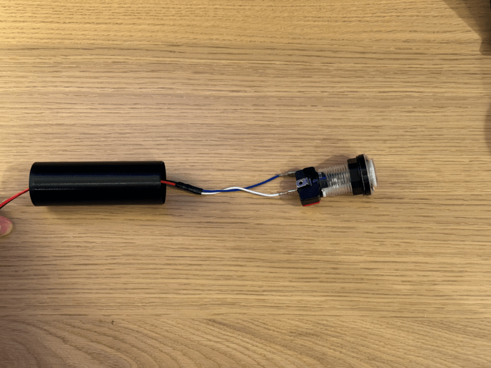

#### Step 5: Adding The 3D Printed Body Lid To The Arcade Button
First disconnect the arcade button from the switch controller (the red and black part) by holding the switch controller with one hand and then twisting off the button with your other hand. You should now have the two pieces separated as seen below.

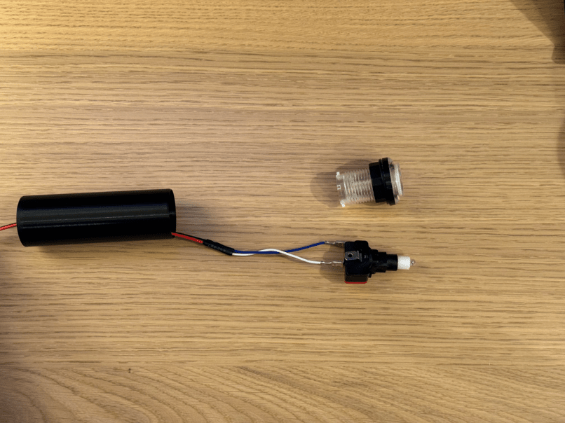

Next, remove the plastic bolt-type thing from the arcade button and the plastic ring (we will no longer need this plastic ring). See the picture below.

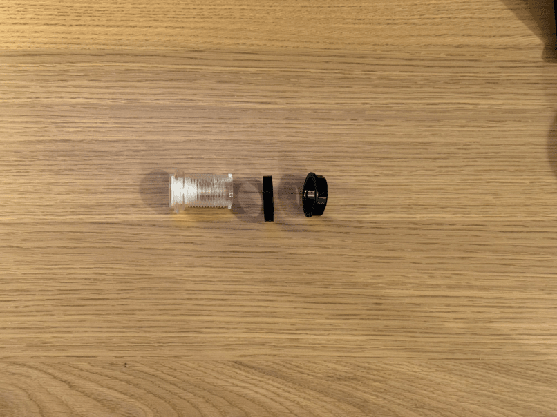

Replace the plastic ring with the 3D printed body lid and re-screw on the plastic bolt-type thing to secure the lid tightly. 

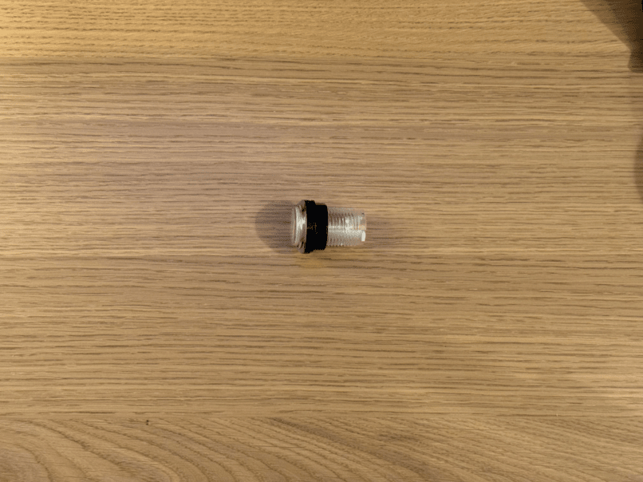

You can now reattach the arcade button to the switch controller by once again holding the switch controller with one hand and then twisting back on the button with your other hand. It should now look like the below picture.

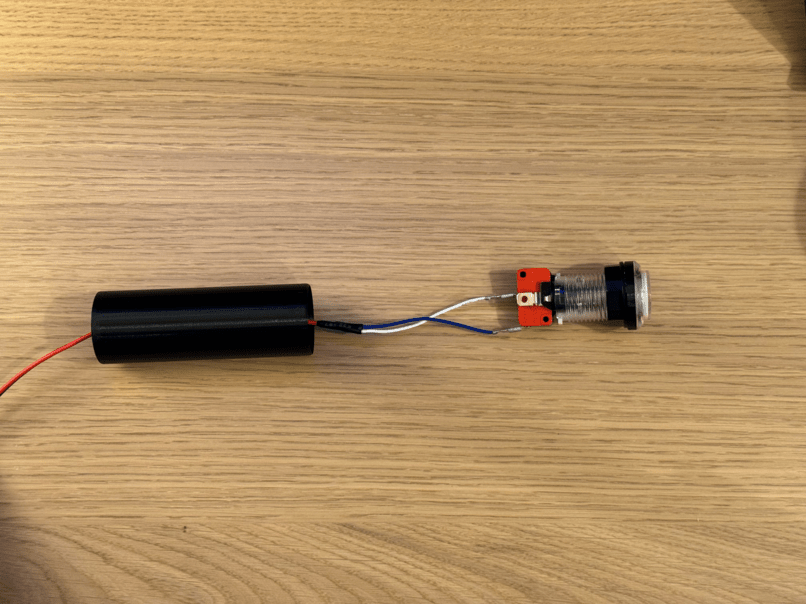

#### Step 6: Insert The Arcade Button Into The 3D Printed Body

You can now pull on the 22 Gauge 2pin 2 Color Wire from the bottom side of the 3D Printed body to slowly retract the arcade button into the 3D Printed body. Once pulled in you can insert the button into the 3D Printed body. It should now look like the below picture.

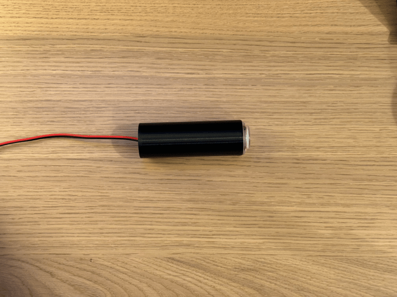

#### Step 7: Admire Your Newly Created Buzzer
YOU DID IT! You now have one complete buzzer. 

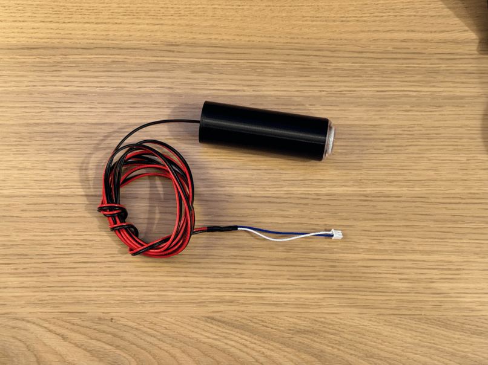

Before building another one we recommend testing this buzzer by following the instructions in [Connecting The Physical Buzzers To JParty](#connecting-the-physical-buzzers-to-jparty)

Duplicate this process 5 times and you have 5 well made buzzers! (4 buzzers are supported in the code at the moment, this will be changed to 5 soon)

All Five Buzzers:

### Connecting The Physical Buzzers To JParty: 
As mentioned in the [What You Need (Parts List)](#what-you-need) section you will need an "Easyget 2 Player Zero Delay Generic Game Controller USB" (Referred to as the "USB Controller" in the rest of this connection section) in order to connect the controllers to JParty!. 

Before Connecting the USB Controller to JParty! it is important to understand what ports are used for the physical buzzers. In the image below you can see where each buzzer's wire harness connector should be plugged in. Each physical buzzer should be plugged into the corresponding port as diagrammed in the picture below.

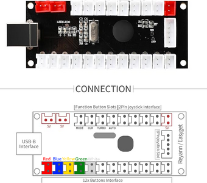

You can plug them into each port as shown below:
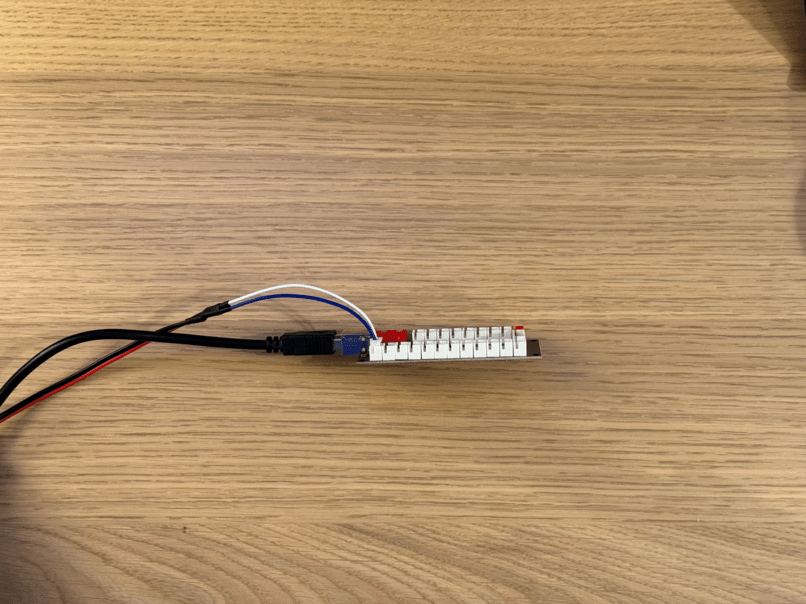

Once all five are plugged in you can connect the USB cable to the USB-B interface on the USB controller and the other USB-A end to your computer. After you have this you can start up JParty! and it should all be connected. 

**Choosing your buzzer on your mobile device:**
Each player will select their buzzer color on their mobile device after scanning the QR code. If you are not playing with physical buzzers you can select the "Phone Only" option. Keep in mind that JParty! Supports up to 8 players, but only supports 5 physical buzzers at the moment. So If you would like 3 more players can play without physical buzzers.

### 3D Printing Instructions: 

There are two parts that need to be 3D printed to build the physical buzzers. The physical buzzer body and its lid. 

Both of these can be printed under regular settings using PLA (this is what we used). 

These parts can be seen below. The parts should also be printed in the same orientation as seen below. The main body is printed with the small hole side at its base (opposite orientation of the STL file by default). The lid can be printed on either side, both sides are the same. 

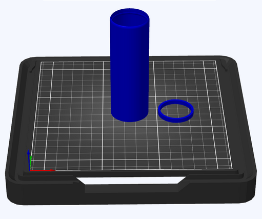

*Note: the buzzer lid is designed to be a snap-fit, if it is not snap-fit for you, you can try the following options:*
- I have included two additional files a lid with a 33.10 mm diameter and a 33.30 mm outside diameter. You can try these before trying any of the other options below if you would like. 
- Currently, the outside diameter of the lid is 33.20 mm (not renamed file). Because of this, if the lid is not a snap-fit for you, you can adjust the scale. Adjusting the .3% adjusts the outside diameter by about .1 mm (.0996 to be exact). This is all assuming my math is correct lol. With this in mind, I would recommend adjusting the scale of the lid by .3% at a time depending if it is too large or too small.
- If this scaling does not work for you, I would recommend gluing it in place with hot glue or superglue if it is too small, or sanding it down a bit if it is too big. 

